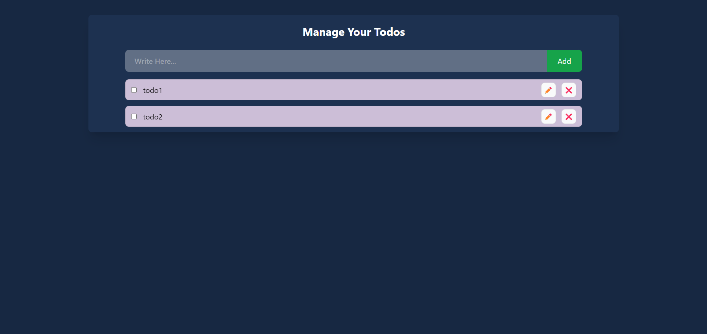
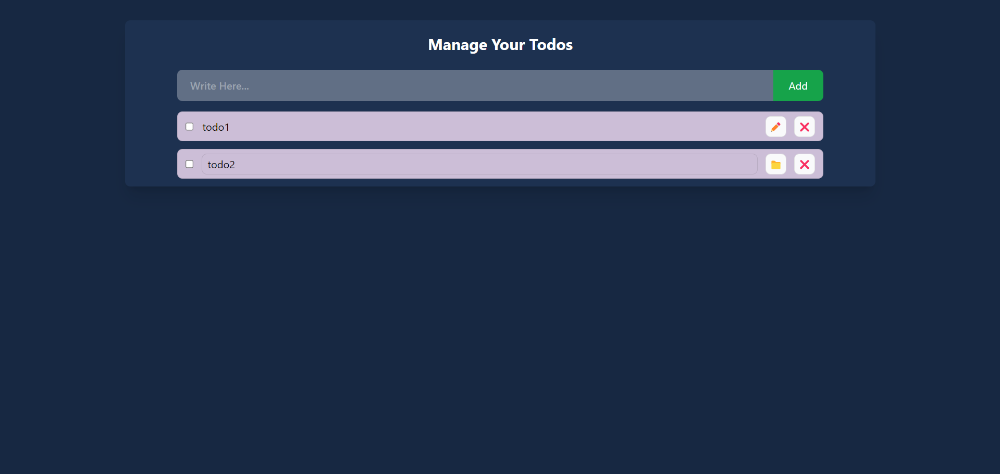

# To-Do Application

A simple and interactive To-Do application built with React that allows users to manage their tasks efficiently. The app supports task creation, deletion, and marking tasks as completed.

## Features

- Add new tasks with a title.
- Mark tasks as completed.
- Delete tasks.

## Demo

<a href="https://task-management-todo.netlify.app/" >Link to To-Do Application</a>

## Technologies Used

- **React** - A JavaScript library for building user interfaces
- **Tailwind CSS** - A utility-first CSS framework for designing responsive interfaces
- **Hooks** - To manage state and lifecycle in functional components
- **Context API** - To manage global state
- **Local Storage** - To manage todos

## Screenshots

